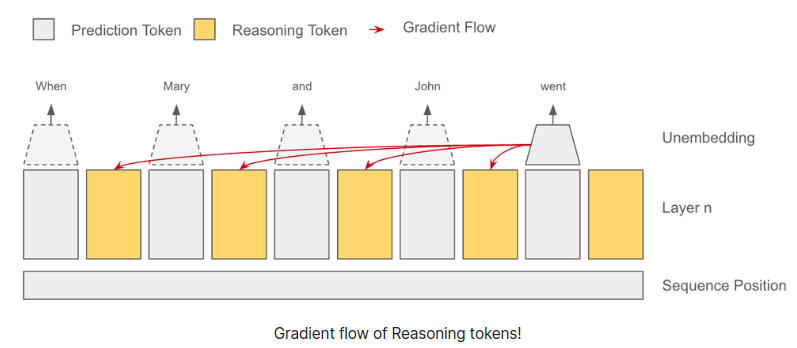
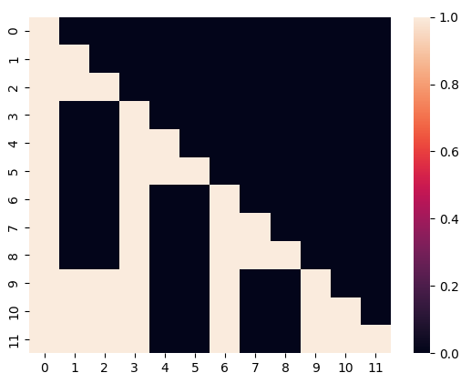

</img>

## Self Reasoning Tokens - Pytorch (wip)

Exploration into the proposed <a href="https://reasoning-tokens.ghost.io/reasoning-tokens/">Self Reasoning Tokens</a> by Felipe Bonetto. The blog post seems a bit unfleshed out, but the idea of stop gradients from next token(s) is an interesting one.

My initial thought was to apply a stop gradient mask on the attention matrix, but then realized that the values of the "reasoning" tokens could not be stop gradiented correctly without memory issues.

While walking the dog and meditating on this, I came to the realization that one can create independent stop gradient masks for queries, keys, values in either flash attention or a custom attention backwards, and there may be a whole array of possibilities there. If any experiments come back positive from this exploration, will build out a concrete implementation of this.

## Install

```bash
$ pip install self-reasoning-tokens-pytorch
```

## Usage

```python
import torch
from self_reasoning_tokens_pytorch import Transformer

model = Transformer(
    dim = 512,
    depth = 4,
    num_tokens = 256,
    stop_grad_next_tokens_to_reason = True
)

x = torch.randint(0, 256, (1, 4))

loss = model(
    x,
    num_reason_tokens = 4,                # number of reasoning tokens per time step
    num_steps_future_can_use_reason = 16, # say you wish for reason tokens to be only attended to by tokens 16 time steps into the future
    return_loss = True
)

loss.backward()

logits = model(x, num_reason_tokens = 4)
```

Or use the novel attention with ability to pass specific stop gradient masks for queries, keys, values

```python
import torch
from self_reasoning_tokens_pytorch import stop_graddable_attn

q = torch.randn(2, 8, 1024, 64)
k = torch.randn(2, 8, 1024, 64)
v = torch.randn(2, 8, 1024, 64)

stop_grad_mask = torch.randint(0, 2, (8, 1024, 1024)).bool()

out = stop_graddable_attn(
    q, k, v, causal = True,
    q_stop_grad_mask = stop_grad_mask,
    k_stop_grad_mask = stop_grad_mask,
    v_stop_grad_mask = stop_grad_mask
)

out.shape # (2, 8, 1024, 64)
```

The mask should look something like

</img>

## Todo

- [ ] deviating from blog post, also try optimizing only a subset of attention heads by tokens far into the future

## Citations

```bibtex
@misc{Bonetto2024,
    author  = {Felipe Bonetto},
    url     = {https://reasoning-tokens.ghost.io/reasoning-tokens/}
}
```
